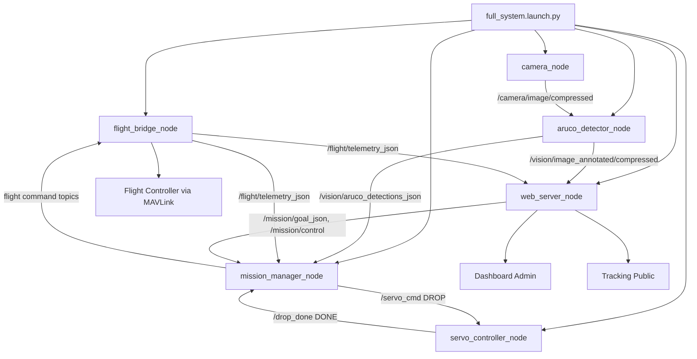
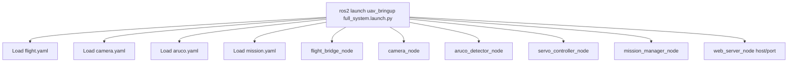
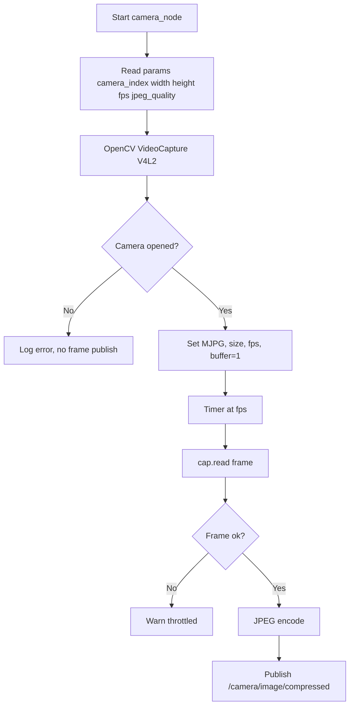
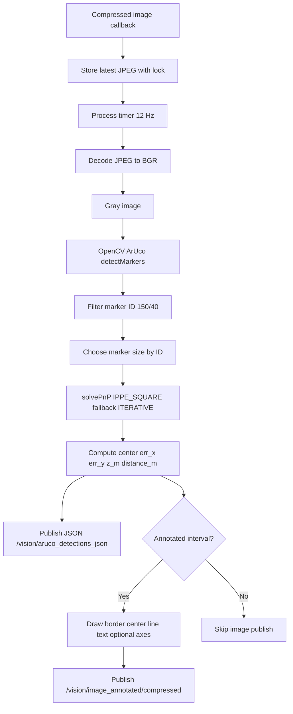
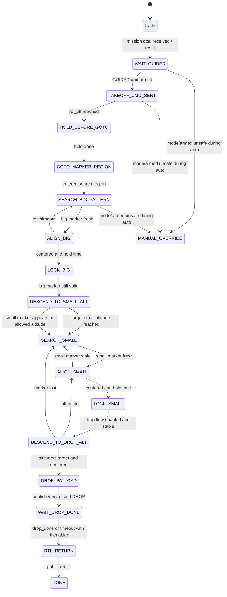
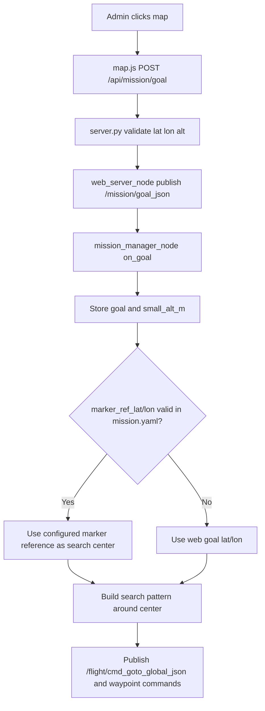
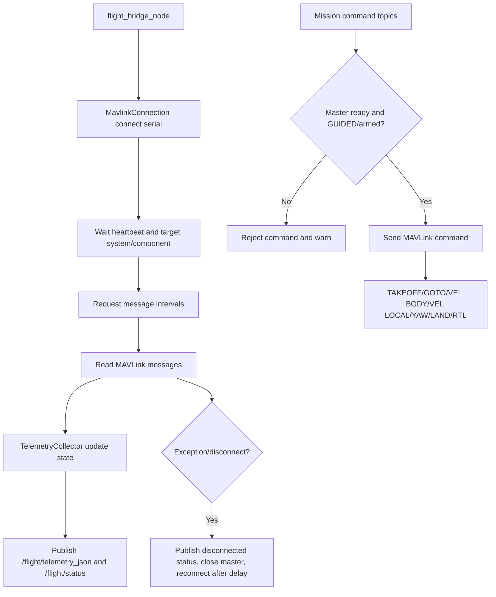
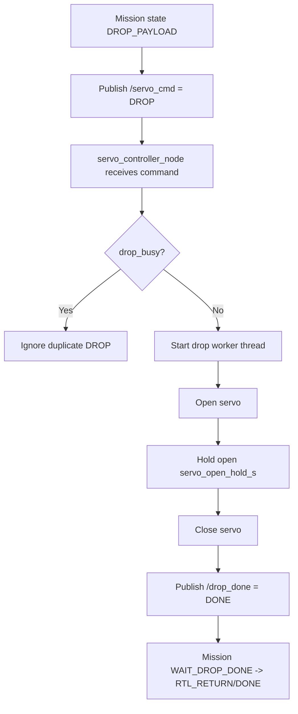
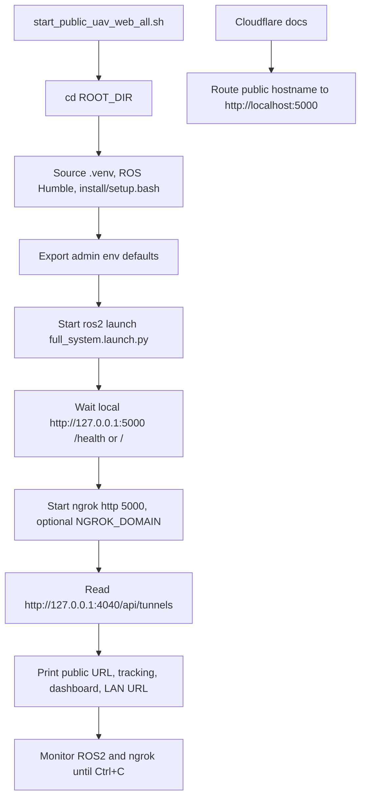
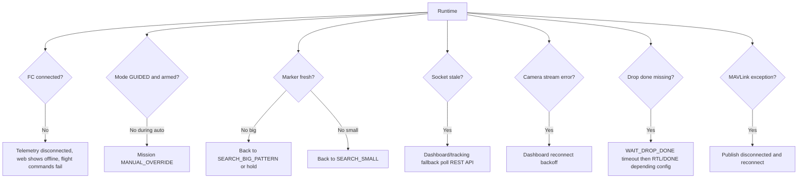

# SYSTEM BEGIN-TO-FINAL FLOW

Tài liệu này mô tả luồng hoạt động thực tế của project ROS2 UAV Drone Delivery từ lúc launch hệ thống đến khi camera, ArUco vision, mission, MAVLink flight bridge, servo dropper, web dashboard và tracking page vận hành.

## Mục lục

1. [Tổng quan hệ thống](#1-tổng-quan-hệ-thống)
2. [Package/file chính và vai trò](#2-packagefile-chính-và-vai-trò)
3. [ROS2 node/topic](#3-ros2-nodetopic)
4. [API route](#4-api-route)
5. [Socket.IO event](#5-socketio-event)
6. [Config YAML quan trọng](#6-config-yaml-quan-trọng)
7. [Lưu đồ hệ thống](#7-lưu-đồ-hệ-thống)
8. [BEGIN to FINAL theo từng module](#8-begin-to-final-theo-từng-module)
9. [Rủi ro, fallback và safety](#9-rủi-ro-fallback-và-safety)
10. [Checklist test end-to-end](#10-checklist-test-end-to-end)
11. [Kết luận](#11-kết-luận)

## 1. Tổng quan hệ thống

Hệ thống được launch qua `uav_bringup full_system.launch.py`, tạo các node ROS2 chính:

- `flight_bridge_node`: kết nối MAVLink với flight controller, publish telemetry và nhận command bay.
- `camera_node`: lấy ảnh từ USB camera/OpenCV, publish JPEG compressed.
- `aruco_detector_node`: nhận ảnh compressed, detect ArUco, estimate pose, publish JSON detection và ảnh annotated.
- `servo_controller_node`: nhận lệnh drop payload, điều khiển PCA9685/servo và publish drop done.
- `mission_manager_node`: state machine nhiệm vụ, nhận telemetry/goal/ArUco/drop_done và phát command bay/drop.
- `web_server_node`: bridge ROS2 sang Flask/Socket.IO dashboard/tracking.

Luồng tổng quát:

```text
Camera -> ArUco Detector -> Mission Manager -> Flight Bridge -> MAVLink FC
                         -> Web Bridge -> Dashboard/Tracking
Mission Goal từ Dashboard -> Mission Manager
Mission Drop -> Servo Controller -> Drop Done -> Mission Manager -> RTL/DONE
```

## 2. Package/file chính và vai trò

| Package/File | Vai trò |
|---|---|
| `src/uav_bringup/launch/full_system.launch.py` | Launch toàn bộ 6 node chính của hệ thống. |
| `src/uav_bringup/launch/hover_test.launch.py` | Launch tối giản flight + mission để test hover/mission logic. |
| `src/uav_camera/uav_camera/camera_node.py` | Mở camera OpenCV V4L2, cấu hình MJPG/resolution/FPS, publish `/camera/image/compressed`. |
| `src/uav_camera/config/camera.yaml` | Cấu hình camera index, width, height, fps, JPEG quality. |
| `src/uav_vision/uav_vision/aruco_detector_node.py` | Node ArUco đang được launch: subscribe ảnh, detect marker, estimate pose, publish JSON + ảnh annotated. |
| `src/uav_vision/uav_vision/aruco_detector.py` | Script/node ArUco cũ, không thấy được gọi trong `full_system.launch.py`. |
| `src/uav_vision/uav_vision/aruco_web_detector.py` | Detector phụ cho web/legacy, không phải node chính trong launch hiện tại. |
| `src/uav_vision/uav_vision/camera_stream.py` | Stream camera trực tiếp kiểu legacy, không phải luồng web hiện tại. |
| `src/uav_vision/config/aruco.yaml` | Dictionary, marker ID/size, topic input/output, calibration path, FPS xử lý/annotated. |
| `src/uav_vision/calibration/camera_calibration_charuco.yaml` | Calibration camera 640x480 dùng cho pose estimation. |
| `src/uav_vision/calibration/calibtion.py` | Tool tạo/hiệu chuẩn ChArUco. |
| `src/uav_vision/calibration/chup_anh_calib.py` | Tool chụp ảnh calibration từ USB camera. |
| `src/uav_mission/uav_mission/state_machine.py` | Enum state mission. |
| `src/uav_mission/uav_mission/mission_logic.py` | Helper logic waypoint/search/marker utilities. |
| `src/uav_mission/uav_mission/mission_manager_node.py` | State machine chính, xử lý telemetry, goal, ArUco, command bay, drop payload, RTL. |
| `src/uav_mission/config/mission.yaml` | Tham số mission, marker ID, align gains, timeout, drop flow. |
| `src/uav_flight/uav_flight/connection.py` | Mở MAVLink serial, heartbeat, message interval. |
| `src/uav_flight/uav_flight/telemetry.py` | Parse HEARTBEAT, SYS_STATUS, GPS_RAW_INT, GLOBAL_POSITION_INT, ATTITUDE. |
| `src/uav_flight/uav_flight/flight_bridge_node.py` | Publish telemetry JSON/status, nhận takeoff/goto/velocity/land/RTL MAVLink command. |
| `src/uav_flight/config/flight.yaml` | Serial port, baudrate, heartbeat timeout, reconnect delay. |
| `src/uav_servo/uav_servo/servo_controller_node.py` | ROS2 node điều khiển PCA9685/servo theo `/servo_cmd`, publish `/drop_done`. |
| `src/uav_servo/uav_servo/servo_dropper.py` | Script test độc lập servo, không phải node trong launch chính. |
| `src/uav_web_bridge/uav_web_bridge/web_server_node.py` | ROS2 web bridge, subscribe telemetry/ArUco/image/mission state và publish mission goal/control. |
| `src/uav_web_bridge/uav_web_bridge/app/server.py` | Flask routes, session login, Socket.IO emit, MJPEG `/video_feed`. |
| `src/uav_web_bridge/uav_web_bridge/app/static/js/dashboard.js` | Admin dashboard realtime, Socket.IO + fallback poll, camera stream manager. |
| `src/uav_web_bridge/uav_web_bridge/app/static/js/map.js` | Leaflet map admin, gửi mission goal khi click map. |
| `src/uav_web_bridge/uav_web_bridge/app/static/js/tracking.js` | Public tracking page, hiển thị trạng thái giao hàng, map, ETA, fallback poll. |
| `src/uav_web_bridge/uav_web_bridge/app/templates/*.html` | Landing, login, dashboard, tracking UI. |
| `tools/start_public_uav_web_all.sh` | Source env, launch ROS2 full system, đợi web, chạy ngrok, in URL public. |
| `tools/start_ngrok_public_web.sh` | Chỉ chạy ngrok cho web local đã chạy. |
| `docs/ngrok_public_setup.md` | Hướng dẫn public web bằng ngrok. |
| `docs/public_domain_setup.md` | Hướng dẫn Cloudflare/ngrok domain. |

## 3. ROS2 node/topic

| Node | Subscribe | Publish | Ghi chú |
|---|---|---|---|
| `camera_node` | Không có ROS topic input | `/camera/image/compressed` (`sensor_msgs/CompressedImage`) | 640x480, 15 FPS, JPEG quality 70 theo config. |
| `aruco_detector_node` | `/camera/image/compressed` | `/vision/aruco_detections_json`, `/vision/image_annotated/compressed` | Detect 12 Hz, annotated 4 Hz, chỉ giữ marker ID cấu hình. |
| `mission_manager_node` | `/flight/telemetry_json`, `/mission/goal_json`, `/mission/control`, `/vision/aruco_detections_json`, `/drop_done` | `/mission/state`, `/flight/cmd_takeoff_json`, `/flight/cmd_goto_global_json`, `/flight/cmd_vel_body_json`, `/flight/cmd_vel_local_json`, `/flight/cmd_hold_yaw_json`, `/flight/cmd_land`, `/servo_cmd`, `/flight/cmd_rtl` | State machine nhiệm vụ và precision landing/drop. |
| `flight_bridge_node` | `/flight/cmd_takeoff_json`, `/flight/cmd_goto_global_json`, `/flight/cmd_vel_body_json`, `/flight/cmd_vel_local_json`, `/flight/cmd_hold_yaw_json`, `/flight/cmd_land`, `/flight/cmd_rtl` | `/flight/telemetry_json`, `/flight/status` | Bridge MAVLink serial `/dev/ttyACM0`. |
| `servo_controller_node` | `/servo_cmd` | `/drop_done` | Nhận `DROP`, `OPEN`, `CLOSE`; khi drop thành công publish `DONE`. |
| `web_server_node` | `/flight/telemetry_json`, `/vision/aruco_detections_json`, `/vision/image_annotated/compressed`, `/mission/state` | `/mission/goal_json`, `/mission/control` | Chạy Flask/Socket.IO trong thread riêng. |

## 4. API route

| Route | Method | Auth | Vai trò |
|---|---|---|---|
| `/` | GET | Public | Landing page. |
| `/tracking` | GET | Public | Trang tracking khách hàng. |
| `/dashboard` | GET | Admin login | Dashboard vận hành. |
| `/legacy` | GET | Admin login | Alias dashboard. |
| `/admin/login` | GET/POST | Public form | Đăng nhập admin bằng env/default credentials. |
| `/admin/logout` | GET | Public | Xóa session. |
| `/health` | GET | Public | Trả `status`, `service`, `fc_connected`. |
| `/api/gps-stations` | GET | Public | Đọc `data/missions/gps_stations.json` nếu có. |
| `/api/aruco-markers` | GET | Public | Trả list marker mới nhất từ ROS. |
| `/api/telemetry` | GET | Public | Trả telemetry snapshot. |
| `/api/drone-position` | GET | Public | Trả lat/lon/mode/armed/alt/sat nếu có tọa độ. |
| `/api/mission/state` | GET | Public | Trả mission state snapshot. |
| `/api/mission/goal` | POST | Admin login | Gửi goal `{lat, lon, search_alt_m, small_alt_m}` sang `/mission/goal_json`. |
| `/api/mission/control` | POST | Admin login | Gửi command text sang `/mission/control`. |
| `/video_feed` | GET | Admin login | MJPEG stream từ ảnh annotated ArUco. |

## 5. Socket.IO event

| Event | Direction | Payload | Nguồn |
|---|---|---|---|
| `telemetry` | Server -> client | Telemetry dict từ `/flight/telemetry_json` | `update_telemetry_state_from_ros`. |
| `aruco_markers` | Server -> client | List marker detection | `update_aruco_state_from_ros`; emit khi signature marker đổi. |
| `mission_state` | Server -> client | Mission state dict | `update_mission_state_from_ros`. |
| `live_log` | Server -> client | String hoặc `{message, level}` | Dashboard có handler, nhưng không thấy server emit chủ động trong code hiện tại. |
| `connect` | Client -> server | Socket connect | Server gửi snapshot telemetry/marker/mission ngay khi connect. |

## 6. Config YAML quan trọng

| File | Tham số chính | Giá trị hiện tại/ý nghĩa |
|---|---|---|
| `src/uav_camera/config/camera.yaml` | `camera_index`, `width`, `height`, `fps`, `jpeg_quality` | `0`, `640`, `480`, `15`, `70`. |
| `src/uav_vision/config/aruco.yaml` | `input_topic`, `annotated_topic`, `detections_topic` | `/camera/image/compressed`, `/vision/image_annotated/compressed`, `/vision/aruco_detections_json`. |
| `src/uav_vision/config/aruco.yaml` | `dictionary`, `big_marker_id`, `small_marker_id` | `DICT_4X4_1000`, `150`, `40`. |
| `src/uav_vision/config/aruco.yaml` | `big_marker_size_m`, `small_marker_size_m` | `0.70 m`, `0.08 m`. |
| `src/uav_vision/config/aruco.yaml` | `process_fps`, `annotated_fps`, `jpeg_quality` | `12`, `4`, `60`. |
| `src/uav_vision/calibration/camera_calibration_charuco.yaml` | `image_width`, `image_height`, `camera_matrix`, `distortion_coefficients` | 640x480, fx/fy khoảng 648, distortion ChArUco RMS khoảng 0.3245. |
| `src/uav_mission/config/mission.yaml` | Takeoff/search | takeoff 7 m, search radius/loop, hardcoded marker reference lat/lon. |
| `src/uav_mission/config/mission.yaml` | ArUco marker IDs | big `150`, small `40`, small enable altitude `4.0 m`. |
| `src/uav_mission/config/mission.yaml` | Align gains | Big: `vx_from_err_y=-0.004`, `vy_from_err_x=0.003`; Small: `-0.0037`, `0.0025`. |
| `src/uav_mission/config/mission.yaml` | Drop flow | `enable_drop_after_lock_small=true`, drop alt 1.5 m, ArUco z 1.45 m, RTL after drop. |
| `src/uav_flight/config/flight.yaml` | MAVLink | `/dev/ttyACM0`, baud `115200`, heartbeat timeout 15 s, reconnect delay 2 s. |

## 7. Lưu đồ hệ thống

### 7.1 Lưu đồ tổng quan



### 7.2 Lưu đồ ROS2 launch



### 7.3 Lưu đồ camera



### 7.4 Lưu đồ ArUco vision



### 7.5 Lưu đồ mission state machine



### 7.6 Lưu đồ GPS/waypoint/mission goal



### 7.7 Lưu đồ MAVLink/flight bridge



### 7.8 Lưu đồ servo/drop payload



### 7.9 Lưu đồ web bridge

```mermaid
flowchart TD
    A[web_server_node] --> B[Subscribe ROS telemetry/aruco/image/mission]
    A --> C[Register mission goal/control publishers]
    A --> D[Start Flask Socket.IO server]
    B --> E[server.py in-memory telemetry_state]
    B --> F[aruco_state markers]
    B --> G[vision_state frame_jpeg]
    B --> H[mission_state snapshot]
    E --> I[Socket emit telemetry]
    F --> J[Socket emit aruco_markers]
    H --> K[Socket emit mission_state]
    G --> L[/video_feed MJPEG]
    M[POST /api/mission/goal/control] --> C
```

### 7.10 Lưu đồ dashboard admin

```mermaid
flowchart TD
    A[/dashboard] --> B{Admin session?}
    B -- No --> C[/admin/login]
    B -- Yes --> D[dashboard.html]
    D --> E[dashboard.js init socket]
    D --> F[map.js init Leaflet]
    D --> G[Camera stream /video_feed]
    E --> H[Render telemetry, mission, markers]
    E --> I[Fallback poll /api/telemetry and /api/mission/state]
    F --> J[Click map sends /api/mission/goal]
    G --> K[Pause/reconnect/fullscreen camera controls]
```

### 7.11 Lưu đồ tracking page

```mermaid
flowchart TD
    A[/tracking public] --> B[tracking.html]
    B --> C[tracking.js init Leaflet]
    C --> D[Socket telemetry and mission_state]
    D --> E[Classify delivery step]
    E --> F[Update title/status/timeline/ETA]
    D --> G[Draw drone marker and route]
    D --> H[Draw mission destination from mission.goal]
    C --> I[Fallback poll /api/telemetry and /api/mission/state if stale]
```

### 7.12 Lưu đồ login admin

```mermaid
flowchart TD
    A[Open /dashboard or protected route] --> B{session admin_authenticated?}
    B -- Yes --> C[Allow dashboard/video/api POST]
    B -- No --> D[Redirect /admin/login?next=...]
    D --> E[Submit username/password]
    E --> F{hmac compare with env/default credentials}
    F -- Yes --> G[Set session admin_authenticated]
    G --> H[Redirect next path]
    F -- No --> I[Render login error]
    J[/admin/logout] --> K[session.clear]
```

### 7.13 Lưu đồ public web bằng ngrok/Cloudflare



### 7.14 Lưu đồ lỗi/fallback/safety



## 8. BEGIN to FINAL theo từng module

### BEGIN 1 - Launch

`tools/start_public_uav_web_all.sh` có thể chạy toàn bộ public demo: source `.venv`, ROS Humble, `install/setup.bash`, export env admin mặc định, chạy `ros2 launch uav_bringup full_system.launch.py`, đợi web local, rồi mở ngrok. Nếu chỉ chạy local, `full_system.launch.py` trực tiếp tạo các node chính.

### BEGIN 2 - Camera

`camera_node` lấy ảnh từ `camera_index=0` bằng OpenCV V4L2, cấu hình MJPG, 640x480, 15 FPS, buffer 1. Node publish `sensor_msgs/CompressedImage` JPEG lên `/camera/image/compressed`. Không thấy resize/crop/rotate/flip trong node chính; vì vậy calibration 640x480 đang khớp với runtime nếu camera thực sự chạy đúng 640x480.

### BEGIN 3 - ArUco vision

`aruco_detector_node` subscribe `/camera/image/compressed`, giữ frame mới nhất và xử lý bằng timer 12 Hz. Node dùng `DICT_4X4_1000`, detect marker bằng OpenCV ArUco, chỉ nhận ID `150` và `40`. Pose estimation dùng `solvePnP` với `SOLVEPNP_IPPE_SQUARE`, fallback `SOLVEPNP_ITERATIVE`. Output JSON có dạng:

```json
{
  "count": 1,
  "detections": [
    {
      "marker_id": 150,
      "id": 150,
      "size_m": 0.7,
      "label": "big",
      "center_x": 320.0,
      "center_y": 240.0,
      "err_x": 0.0,
      "err_y": 0.0,
      "x_m": 0.0,
      "y_m": 0.0,
      "z_m": 2.0,
      "distance_m": 2.0,
      "rvec": [],
      "tvec": []
    }
  ]
}
```

`err_x/err_y` là sai số pixel từ tâm ảnh, không phải mét. `x_m/y_m/z_m` lấy trực tiếp từ frame camera OpenCV: x sang phải ảnh, y xuống ảnh, z hướng ra trước camera. Mission hiện dùng `err_x/err_y` để tạo velocity body, không thấy chuyển frame camera sang body/local bằng ma trận ngoại suy trong detector.

### BEGIN 4 - Calibration

Calibration chính là `camera_calibration_charuco.yaml`, image size 640x480. Nếu file calibration lỗi hoặc thiếu, detector raise exception khi khởi động, không fallback sang no-pose mode. Nếu camera runtime không đúng 640x480 nhưng calibration vẫn 640x480, `z_m/distance_m` có thể sai. Node detector có kiểm tra resolution thực tế so với calibration ở mức warning, cần theo dõi log khi test.

### BEGIN 5 - Marker ID và size

Luồng chính đang dùng big marker ID `150`, size `0.70 m`; small marker ID `40`, size `0.08 m`. Đây là config trong `aruco.yaml`, đồng thời mission config cũng dùng ID 150/40. Rủi ro lớn là sai đơn vị cm/m hoặc kích thước marker thực tế không đúng config, vì pose `z_m` tỉ lệ trực tiếp với marker size.

### BEGIN 6 - Mission manager

Dashboard gửi goal qua `/api/mission/goal` -> `/mission/goal_json`. Mission nhận goal, nhưng search center ưu tiên `marker_ref_lat/lon` trong `mission.yaml` nếu hợp lệ; goal web chủ yếu lưu trạng thái và `small_alt_m`. Mission yêu cầu FC ở GUIDED và armed để tự động bay; nếu mất điều kiện trong auto state, chuyển `MANUAL_OVERRIDE`.

Mission dùng marker theo phase:

- Big phase: tìm/align/lock marker ID 150.
- Descend to small altitude: dùng big để descent/recenter, có thể chuyển sang small nếu đủ thấp và thấy small.
- Small phase: tìm/align/lock marker ID 40.
- Drop phase: descent đến điều kiện drop, publish `/servo_cmd`.

Freshness marker dựa trên thời điểm mission nhận JSON, với timeout từ config. Khi marker stale, mission quay lại search hoặc hold tùy phase, giúp giảm rủi ro dùng detection cũ.

### BEGIN 7 - Flight bridge/MAVLink

`flight_bridge_node` kết nối `/dev/ttyACM0` baud `115200`, đợi heartbeat, request stream MAVLink và publish telemetry JSON. Command từ mission được chuyển thành MAVLink:

- Takeoff: `MAV_CMD_NAV_TAKEOFF`.
- Goto: `SET_POSITION_TARGET_GLOBAL_INT`.
- Velocity body/local: `SET_POSITION_TARGET_LOCAL_NED`.
- Hold yaw: `MAV_CMD_CONDITION_YAW`.
- Land/RTL: set mode nếu có, fallback command MAVLink.

Bridge reject command nếu không có master hoặc không GUIDED+armed. Đây là safety tốt cho auto command, nhưng cũng cần chú ý RTL có thể bị reject nếu mode không còn GUIDED.

### BEGIN 8 - Servo/drop payload

Mission publish `/servo_cmd = DROP` trong state `DROP_PAYLOAD`. `servo_controller_node` dùng PCA9685 qua I2C bus 5, address 0x40, channel mặc định 4, mở servo, giữ `servo_open_hold_s=3.0`, đóng lại, rồi publish `/drop_done = DONE`. Script test độc lập `servo_dropper.py` dùng channel 3 và góc/hold khác, nên cần xác nhận hardware wiring đang theo node ROS hay script test.

### BEGIN 9 - Web bridge

`web_server_node` subscribe telemetry, ArUco JSON, annotated image và mission state. Các callback cập nhật state trong `server.py`, emit Socket.IO realtime, đồng thời REST API trả snapshot. `/video_feed` lấy `vision_state.frame_jpeg` để stream MJPEG annotated image.

### BEGIN 10 - Dashboard admin

`/dashboard` yêu cầu login. `dashboard.js` nhận `telemetry`, `aruco_markers`, `mission_state`, cập nhật trạng thái FC/GPS/battery/camera/vision/socket, mission timeline, big/small marker fields, log UI và camera stream. Nếu socket stale, dashboard fallback poll `/api/telemetry` và `/api/mission/state`. Map admin gửi mission goal bằng click trên Leaflet map.

### BEGIN 11 - Tracking page

`/tracking` public, dùng `tracking.js` để hiển thị trạng thái giao hàng từ mission state và telemetry. Trang này không yêu cầu login, có socket realtime và fallback poll. Destination lấy từ `mission.goal` nếu có, nếu chưa có thì lấy GPS station đầu tiên.

### FINAL - End-to-end

End-to-end thực tế:

```text
Launch
  -> Flight bridge kết nối FC và publish telemetry
  -> Camera publish JPEG
  -> ArUco detect marker và publish JSON/image
  -> Mission nhận goal + telemetry + marker, điều khiển takeoff/goto/search/align/drop/RTL
  -> Servo nhận DROP và báo DONE
  -> Web bridge emit telemetry/mission/marker/image
  -> Dashboard admin điều khiển/giám sát
  -> Tracking public hiển thị tiến độ giao hàng
  -> ngrok/Cloudflare public web nếu chạy script tunnel
```

## 9. Rủi ro, fallback và safety

| Mức | Vấn đề | File | Ảnh hưởng | Đề xuất |
|---|---|---|---|---|
| CRITICAL | Marker size/calibration sai thực tế | `aruco.yaml`, `camera_calibration_charuco.yaml` | `z_m/distance_m` sai, drop/landing sai độ cao. | Đo marker thật bằng mét, test pose ở nhiều khoảng cách, xác nhận camera runtime 640x480. |
| CRITICAL | Axis/sign coupling giữa camera pixel error và velocity body | `mission_manager_node.py`, `aruco_detector_node.py` | Align có thể ngược hướng hoặc bay vòng nếu camera orientation khác giả định. | Test treo dây/không cánh hoặc SITL, xác nhận từng chiều err_x/err_y -> vx/vy. |
| HIGH | `servo_controller_node.py` dùng channel 4, `servo_dropper.py` test dùng channel 3 | `uav_servo` | Test độc lập có thể khác wiring node thật. | Chốt channel/góc trong tài liệu/hardware checklist trước khi bay. |
| HIGH | `search_center_latlon()` ưu tiên marker_ref config hơn goal web | `mission_manager_node.py`, `mission.yaml` | Click goal trên dashboard có thể không đổi tâm search nếu marker_ref hợp lệ. | Làm rõ vận hành: dùng marker_ref cố định hay goal web làm search center. |
| HIGH | RTL command bridge yêu cầu GUIDED+armed | `flight_bridge_node.py` | Nếu mode đổi khỏi GUIDED trước RTL, lệnh RTL từ mission có thể bị reject. | Test ABORT/drop timeout/RTL trong điều kiện mode khác nhau. |
| HIGH | Public web dùng default admin/password nếu env không đổi | `server.py`, scripts/docs | Rủi ro bảo mật khi public ngrok. | Đổi env thật, secret key dài, cân nhắc `UAV_COOKIE_SECURE=1` khi qua HTTPS. |
| MEDIUM | Web `aruco_markers` chỉ emit khi marker signature ID/center đổi | `server.py` | Field pose thay đổi nhưng center không đổi có thể không emit marker event. | Dashboard chính dùng mission_state cho marker detail; nếu cần raw pose realtime, signature nên thêm z/distance. |
| MEDIUM | `/video_feed` chỉ có frame khi detector publish annotated | `server.py`, `aruco_detector_node.py` | Dashboard camera có thể trống nếu detector chưa chạy/calibration fail. | Test camera raw và detector startup riêng; hiển thị trạng thái rõ khi không có frame. |
| MEDIUM | CPU Orange Pi: detect 12 Hz + encode camera 15 Hz + annotated JPEG 4 Hz + web stream | `camera_node.py`, `aruco_detector_node.py`, `server.py` | Lag vision/web, stale marker. | Đo CPU/FPS thực tế, giảm FPS/quality nếu cần. |
| MEDIUM | Landing/drop gần mặt đất phụ thuộc marker còn trong FOV | `mission_manager_node.py` | Mất marker gần mặt đất làm quay lại search/hold, không drop. | Test small marker ở độ cao thấp, FOV, ánh sáng, motion blur. |
| LOW | Legacy ArUco files có config khác marker size | `aruco_detector.py` | Dễ nhầm khi chạy script cũ. | Ghi rõ node chính là `aruco_detector_node.py`. |

Fallback/safety hiện có:

- Mission kiểm tra GUIDED + armed trước auto command; mất điều kiện chuyển `MANUAL_OVERRIDE`.
- Marker có timeout/freshness; small/big phase lọc marker theo expected ID.
- Dashboard/tracking có REST fallback khi Socket.IO stale.
- Camera stream dashboard có reconnect backoff.
- Flight bridge tự reconnect MAVLink khi lỗi.
- Servo drop có `drop_busy` chống lệnh drop trùng.
- WAIT_DROP_DONE có timeout và có thể RTL theo config.

## 10. Checklist test end-to-end

- Build/source workspace, chạy `ros2 launch uav_bringup full_system.launch.py`.
- Kiểm tra node list đủ 6 node chính.
- Kiểm tra `/flight/telemetry_json` có `connected`, `mode`, `armed`, GPS, altitude.
- Kiểm tra camera publish `/camera/image/compressed` đúng FPS và resolution 640x480.
- Test ảnh tĩnh/live big marker ID 150 ở nhiều khoảng cách: 0.8 m, 1.5 m, 2 m, 3 m.
- Test small marker ID 40 ở độ cao thấp: 0.8 m, 1.2 m, 1.5 m, 2 m.
- So sánh `z_m` với thước đo thực tế, sai số chấp nhận trước bay.
- Che marker 0.5 s, 1 s, 2 s; xác nhận mission không dùng stale marker nguy hiểm.
- Test marker lệch trái/phải/trên/dưới; xác nhận dấu `err_x/err_y` và hướng velocity.
- Test lighting yếu, ngược sáng, motion blur, rung camera.
- Test dashboard `/dashboard`: login, telemetry, mission state, big/small fields, `/video_feed`.
- Test tracking `/tracking`: trạng thái giao hàng, map, ETA, fallback poll khi ngắt socket.
- Test POST `/api/mission/goal` từ map, xác nhận `/mission/goal_json` và mission state goal.
- Test mission không fake lock: timeout big/small không được coi là lock thành công.
- Test servo riêng bằng node ROS: publish `/servo_cmd` `OPEN`, `CLOSE`, `DROP`; xác nhận `/drop_done`.
- Test drop flow giả lập: `DROP_PAYLOAD -> WAIT_DROP_DONE -> RTL_RETURN/DONE`.
- Test mất FC/MAVLink: web báo offline, bridge reconnect, mission vào trạng thái an toàn.
- Test ngrok: chạy `tools/start_public_uav_web_all.sh`, mở landing/tracking/dashboard từ mạng khác.
- Đo CPU/RAM/FPS trên Orange Pi khi camera + ArUco + web + ngrok chạy đồng thời.

## 11. Kết luận

Pipeline hiện tại đã có cấu trúc đầy đủ từ camera đến ArUco, mission, MAVLink, servo và web realtime. Điểm mạnh là các topic tách rõ, mission có state machine explicit, marker có freshness timeout, web có Socket.IO và REST fallback, public tunnel có script tự động.

Trước khi bay thật, các điểm cần xác nhận nghiêm túc nhất là calibration/marker size, dấu trục `err_x/err_y -> vx/vy`, cấu hình servo channel/góc thực tế, hành vi RTL khi mode không còn GUIDED và hiệu năng Orange Pi khi chạy full stack. Tài liệu này chỉ phân tích và ghi nhận luồng hiện có; không thay đổi source code, ROS2 topic, API payload, Socket.IO event, mission logic, control logic, ArUco logic, MAVLink command, servo logic hoặc script public web.
